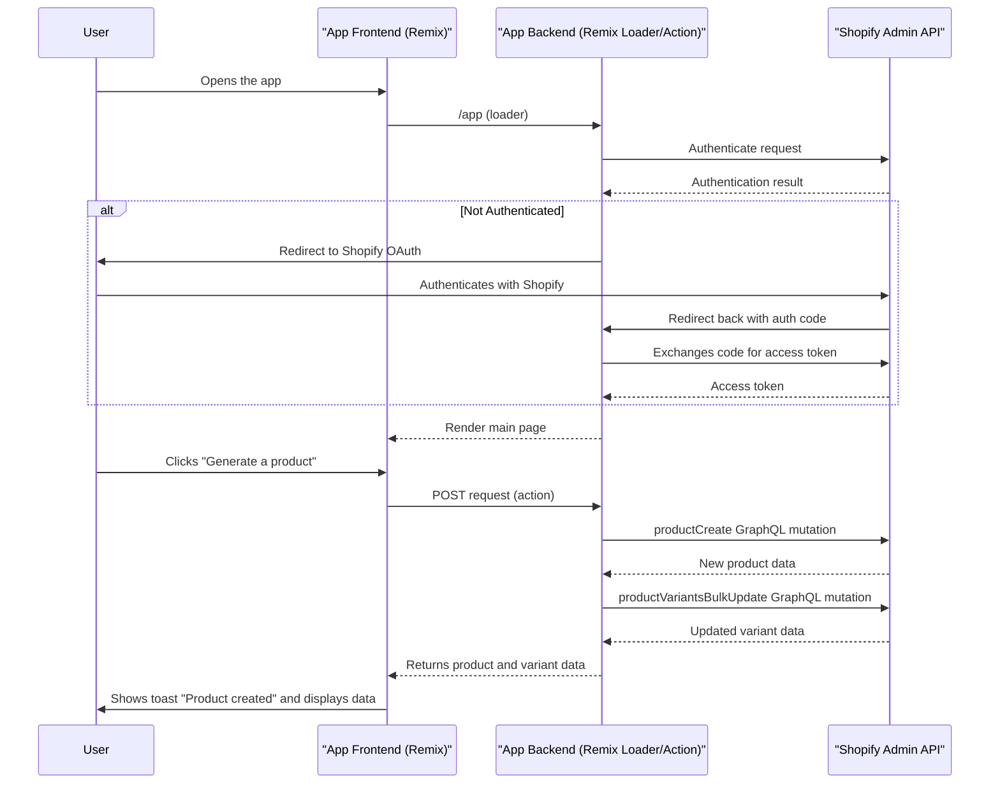

```mermaid
sequenceDiagram
    participant User
    participant AppFrontend as "App Frontend (Remix)"
    participant AppBackend as "App Backend (Remix Loader/Action)"
    participant ShopifyAdminAPI as "Shopify Admin API"

    User->>AppFrontend: Opens the app
    AppFrontend->>AppBackend: /app (loader)
    AppBackend->>ShopifyAdminAPI: Authenticate request
    ShopifyAdminAPI-->>AppBackend: Authentication result
    alt Not Authenticated
        AppBackend->>User: Redirect to Shopify OAuth
        User->>ShopifyAdminAPI: Authenticates with Shopify
        ShopifyAdminAPI->>AppBackend: Redirect back with auth code
        AppBackend->>ShopifyAdminAPI: Exchanges code for access token
        ShopifyAdminAPI-->>AppBackend: Access token
    end
    AppBackend-->>AppFrontend: Render main page
    User->>AppFrontend: Clicks "Generate a product"
    AppFrontend->>AppBackend: POST request (action)
    AppBackend->>ShopifyAdminAPI: productCreate GraphQL mutation
    ShopifyAdminAPI-->>AppBackend: New product data
    AppBackend->>ShopifyAdminAPI: productVariantsBulkUpdate GraphQL mutation
    ShopifyAdminAPI-->>AppBackend: Updated variant data
    AppBackend-->>AppFrontend: Returns product and variant data
    AppFrontend->>User: Shows toast "Product created" and displays data
```
